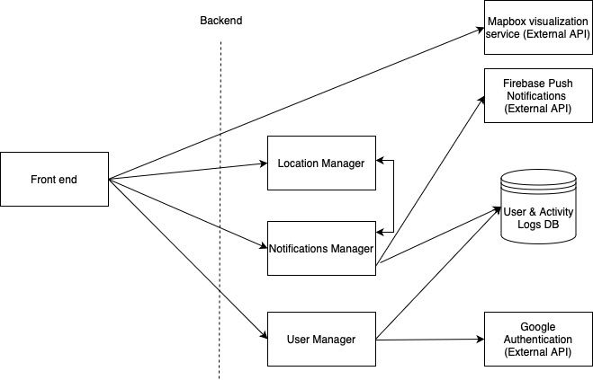
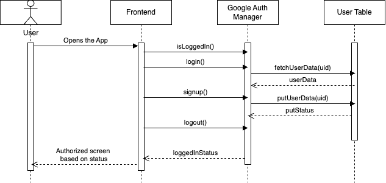
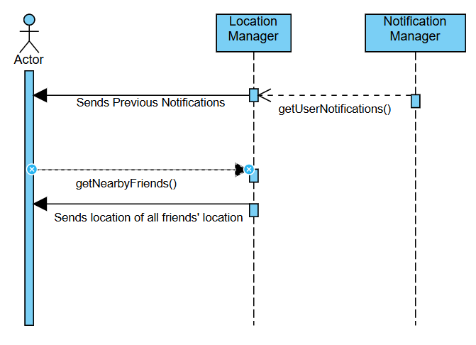
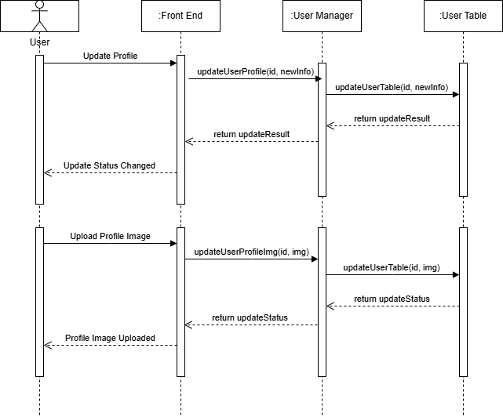
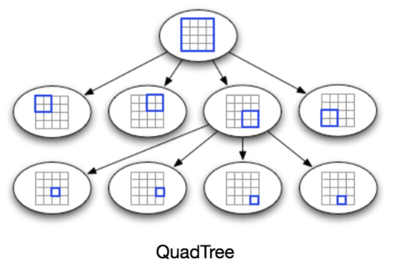

# M3 - Requirements and Design

## 1. Change History

| Date | Modification Description | Rationale |
| ---- | ------------------------ | --------- |
|      |                          |           |

---

## 2. Project Description

**Project Name:** CMIYC - Cache Me If You Can!

**Target Audience:** Individuals who enjoy spontaneous meetups with friends but struggle with coordination or discovering who is nearby and available. Target users include young adults, college students, and professionals who value real-time social connections.

**Problem Statement:** Group chats and manual check-ins are inefficient and frustrating, often leading to missed opportunities for meetups.

**Solution:** "Cache Me If You Can!" allows users to share their real-time location with selected friends, enabling seamless coordination for spontaneous hangouts. The app promotes privacy, spontaneity, and immediate engagement.

**Key Features:** Location-sharing with privacy controls, notifications to update friends, log of status messages from friends.

---

## 3. Requirements Specification

### 3.1. Use-Case Diagram


### 3.2. Actors Description

1. **User**: A person who uses the app to share their real-time location and update their status.
2. **Admin**: A person who can have access to the backend and manages the system data.

### 3.3. Functional Requirements

#### **FR1: Authentication using Google**

- **Overview**:

  1. Registration & Log in
  2. Log out

- **Detailed Flow for Each Independent Scenarios**:

  - **FR1_1**: Registration and Login using Google Authentication service

    - **Description**: When no session is active, new and existing users use Google Authentication service to start a session.
    - **Primary Actors**: User, Admin
    - **Main success scenario(s)**:

      1. New and existing users click on the Google login button on the App’s login page.
      2. User is redirected to a page view where the user enters their Google email and password.
      3. Google Authentication succeeds.
      4. User is redirected out of the login page and into the app’s main page: The map page.

    - **Failure scenario(s)**:
      - 2a. Google authentication service is non-responsive.
        - 2a1. Display error message that Google service is non-responsive and show an OK button.
        - 2a2. When the OK button is clicked, User is redirected back to the login page.
      - 3a. Google authentication fails.
        - 3a1. Users can retry entering their Google email and password.

  - **FR1_2: Logout**
    - **Primary actor(s)**: User, Admin
    - **Main success scenario(s)**:
      1. From a profile page, the user clicks logout.
      2. User logs out successfully.
      3. User is redirected to the login page.
    - **Failure scenario(s)**:
      - 1a. Logout failed; user stays logged in due to network error.
        - 1a1. Display error to logout message and show retry button.

#### **FR2: Manage Friends**

- **Overview**:

  1. Add Friend
  2. Remove Friend
  3. Accept Friend

- **Detailed Flow for Each Independent Scenarios**:

  - **FR2_1: Add Friend**

    - **Description**: Users can add friends by sending friend requests.
    - **Primary actor(s)**: User
    - **Success scenario(s)**:
      1. User sends a friend request.
      2. Friend accepts the request, and the connection is established.
    - **Failure scenario(s)**:
      - 1a. Friend request fails due to a network error.
        - 1a1. Display an error message.
        - 1a2. Retry sending the invitation.
      - 2a. Friend request is not received due to server issues.
        - 2a1. Log the failure and notify the sender.
        - 2a2. Retry sending the invitation.

  - **FR2_2: Remove Friend**

    - **Description**: Users can remove friends from their friend list at any time.
    - **Primary actor(s)**: User
    - **Success scenario(s)**:
      1. User selects a friend to remove.
      2. The friend is removed from the friend list.
      3. The user is also removed from the friend’s list.
    - **Failure scenario(s)**:
      - 1a. Removal fails due to a server issue.
        - 1a1. Display an error message.
        - 1a2. Retry removing the friend.
      - 2a. User attempts to remove a non-existent friend.
        - 2a1. Display a message indicating the friend is not in the list.
      - 3a. Friend’s list does not update correctly.
        - 3a1. Ensure server synchronization and retry adding the user to friend’s list.

  - **FR2_3: Accept Friend**
    - **Description**: The user can accept or deny friend requests.
    - **Primary actor(s)**: User, Friend
    - **Success scenario(s)**:
      1. User receives a friend request.
      2. If the user accepts, that friend is added to their friend list and the friend’s list adds the user.
      3. If the user denies, the friend request is cleared.
    - **Failure scenario(s)**:
      - 1a. Accept request fails due to a network issue.
        - 1a1. Display an error message.
        - 1a2. Retry the accepted request.
      - 2a. Friend’s list does not update correctly.
        - 2a1. Ensure server synchronization and retry adding the user to friend’s list.

#### **FR3: View Friends’ Location**

- **Overview**:

  1. Friend Icon on the Map
  2. Log of Invited Activities
  3. Real-Time Notifications

- **Detailed Flow for Each Independent Scenarios**:

  - **FR3.1 Friend Icon on the Map**

    - **Description**: Users can view their friend’s real-time location.
    - **Primary actor(s)**: User
    - **Main success scenario**:
      1. The user opens the app.
      2. The user can scroll and move the map.
      3. The user sees their friends' locations.
    - **Failure scenario(s)**:
      - 1a. Server fails to update friend locations due to a network error.
        - 1a1. Display an error message.
        - 1a2. Retry location fetching.
      - 2b. Map fails to move in response to the user.
        - 2b1. Display an error message.
        - 2b2. Reload the app.

  - **FR3.2 Log of Invited Activities**

    - **Description**: The user can view a log with all the previously invited activities.
    - **Primary actor(s)**: User
    - **Main success scenario**:
      1. The user switches to the log page.
      2. The user can scroll up and down the log to see the previous invited activities.
    - **Failure scenario(s)**:
      - 1a. Server fails to update the log of previously invited activities.
        - 1a1. Display an error message.
        - 1a2. Retry activity fetching.

  - **FR3.3 Real-Time Notifications**
    - **Description**: The user receives real-time notifications for friend activity status updates.
    - **Primary actor(s)**: User
    - **Main success scenario**:
      1. User receives a notification for an activity invitation or when entering a radius of a previous activity invitation.
    - **Failure scenario(s)**:
      - 1a. Notification fails to send due to server issues.
        - 1a1. Log the failure.
        - 1a2. Retry sending the notification.
      - 2a. Notification is delayed.
        - 2a1. App displays a message notifying the user of the delay.

#### **FR4: Broadcast Activity**

- **Overview**:

  1. Set activity message & Real-time push Notification to all friends
  2. Post a new log to all friends' log list

- **Detailed Flow for Each Independent Scenarios**:

  - **FR4.1 Set activity message & Real-time push Notification to all friends**

    - **Description**: From the Map page, users can enter their activity message and click on broadcast to let all their friends know.
    - **Primary actor(s)**: User
    - **Main success scenarios**:
      1. The user is on the Map page and sets their activity message.
      2. User clicks broadcast.
      3. User’s current activity along with the message “join them” is sent via push notifications to User’s friends.
      4. User’s friend clicks on push notification and is redirected to the map page and centered to the sender’s location.
    - **Failure scenarios**:
      - 2a. Broadcast fails due to a network error.
        - 2a1. Display network error message and show retry button.
      - 3a. Push notification is not delivered due to a network error.
        - 3a1. Retry sending push notification up to a maximum of 5 times without notifying the user of the error.
        - 3a2. If the error still persists after 5 retries, show an error message to the user with a retry button.

  - **FR4.2 Post a new log to all friends’ log list**
    - **Description**: When User broadcasts activity, a new log entry will be added to all friends’ log pages.
    - **Primary actor(s)**: User
    - **Main success scenarios**:
      1. User clicks on the broadcast with a set activity message.
      2. Every User’s friends’ log list is updated with a new entry.
      3. The new entry contains the broadcaster’s name, activity message, and location.
    - **Failure scenarios**:
      - 1a. Sending log entry fails due to a network error.
        - 1a1. App retries sending the log message 5 times without notifying the user.
        - 1a2. If max attempts are exceeded, display an error message to the user with a retry button.

#### **FR5: Manage User Profile**

- **Overview**:

  1. Update Personal Information
  2. Change Profile Photo

- **Detailed Flow for Each Independent Scenarios**:

  - **FR5.1 Update Personal Information**

    - **Description**: Users can edit their personal details, such as name, bio, and contact information, to keep their profile up to date.
    - **Primary actor(s)**: User
    - **Main success scenario**:
      1. Users navigate to their profile settings pages.
      2. Users edit their personal information (e.g., name, bio, contact details).
      3. Changes are saved and reflected in the user’s profile.
    - **Failure scenario(s)**:
      - 1a. Profile update fails due to a network issue.
        - 1a1. App displays an error message.
        - 1a2. App retries saving changes.
      - 2a. Invalid input is detected (e.g., empty name, special characters in bio).
        - 2a1. App displays an error message prompting for corrections.

  - **FR5.2 Change Profile Photo**
    - **Description**: Users can upload or update their profile picture to personalize their account.
    - **Primary actor(s)**: User
    - **Main success scenario**:
      1. User selects a new profile photo from their device.
      2. The app uploads and processes the image.
      3. The new profile photo is updated and displayed in the user’s profile.
    - **Failure scenario(s)**:
      - 1a. Image upload fails due to a network issue.
        - 1a1. App displays an error message and allows retrying.
      - 2a. Uploaded file is not in an accepted format (e.g., non-image file).
        - 2a1. App displays a warning and prompts the user to select a valid image file.

#### **FR6: Manage Users**

- **Overview**:

  1. Ban User
  2. Restrict User

- **Detailed Flow for Each Independent Scenarios**:

  - **FR6.1 Ban User**

    - **Description**: Admins can permanently ban users who engage in harmful behavior, ensuring a safe environment.
    - **Primary actor(s)**: Admin
    - **Main success scenarios**:
      1. Admin selects a user to ban from the system.
      2. The user is banned, preventing them from logging in or accessing the app.
      3. The system notifies the banned user of their status.
    - **Failure scenarios**:
      - 1a. Ban action fails due to a server issue.
        - 1a1. System logs the failure and retries the operation.
        - 1a2. Admin receives an error message if retries fail.
      - 2a. Users attempt to access the app after being banned.
        - 2a1. App displays a message informing the user of their ban status.

  - **FR6.2 Restrict User**
    - **Description**: Admins can temporarily restrict users by limiting their actions, such as posting status updates or sending friend invitations.
    - **Primary actor(s)**: Admin
    - **Main success scenarios**:
      1. Admin selects a user to restrict.
      2. Restrictions (e.g., disabling location sharing, preventing friend requests) are applied.
      3. The restricted user is notified of their limited access.
      4. Admin can later remove restrictions if necessary.
    - **Failure scenarios**:
      - 1a. Restriction fails due to a system error.
        - 1a1. System logs the failure and retries applying the restriction.
        - 1a2. Admin is notified if the restriction does not apply successfully.
      - 2a. User tries to perform restricted actions.
        - 2a1. App displays a message explaining the restriction.

### 3.5. Non-Functional Requirements

1. **NFR1: Real-Time Performance**

   - **Description**: The app must update locations and notifications within 2 seconds.
   - **Justification**: Quick updates ensure seamless coordination.

2. **NFR2: Scalability**

   - **Description**: The backend must handle at least 1000 concurrent users.
   - **Justification**: Scalability is essential for supporting a growing user base.

---

## 4. Design Specification

### 4.1. Main Components

#### **Location Manager**

- **Purpose**: Stores every User's location and handles real-time location updates and sharing.
- **Interfaces**:
  - **updateLocation(String userId, Coordinates location): boolean**
    - **Purpose**: Updates the user's location in the database. Returns true if the update is successful.
  - **getLocation(String userId): Coordinates**
    - **Purpose**: Retrieves the user's current location from the database.
  - **shareLocation(String userId, List<String> friendIds, Duration duration): boolean**
    - **Purpose**: Shares the user's location with selected friends for a specified duration. Returns true if sharing is successfully enabled.
  - **stopSharingLocation(String userId, List<String> friendIds): boolean**
    - **Purpose**: Stops sharing the user's location with selected friends. Returns true if sharing is successfully disabled.
  - **getNearbyFriends(String userId, double radius): List<String>**
    - **Purpose**: Retrieves a list of friends within the specified radius of the user's location. Returns a list of user IDs.

#### **Notification Manager**

- **Purpose**: Manages sending notifications to friends.
- **Interfaces**:
  - **sendNotification(String userId, String message): boolean**
    - **Purpose**: Sends a notification with the given message to the specified userId. Returns true if the notification is successfully sent.
  - **getNotificationStatus(String notificationId): Status**
    - **Purpose**: Retrieves the current status of a sent notification using notificationId. Returns the status (e.g., SENT, DELIVERED, READ).
  - **sendGroupNotification(List<String> userIds, String message): boolean**
    - **Purpose**: Sends a notification with the given message to multiple users specified in userIds. Returns true if the notifications are successfully sent.
  - **markNotificationAsRead(String notificationId): boolean**
    - **Purpose**: Marks the notification identified by notificationId as read. Returns true if the update is successful.
  - **getUserNotifications(String userId): List<Notification>**
    - **Purpose**: Retrieves a list of all notifications received by the user identified by userId. Returns a list of Notification objects.
  - **updateActivityLog(List<String> users, String activity): Boolean**
    - **Purpose**: Updates user activity log. Returns updateStatus as Boolean.

#### **User Manager**

- **Purpose**: Manages user & friend-related operations such as adding, removing, and blocking users.
- **Interfaces**:
  - **sendFriendRequest(String userId, String friendId): boolean**
    - **Purpose**: Sends a friend request from userId to friendId. Returns true if the request is sent successfully.
  - **acceptFriendRequest(String userId, String friendId): boolean**
    - **Purpose**: Accepts a pending friend request, establishing a connection between users. Returns true if successful.
  - **removeFriend(String userId, String friendId): boolean**
    - **Purpose**: Removes friendId from userId’s friend list. Returns true if the friend is successfully removed.
  - **blockUser(String userId, String blockedUserId): boolean**
    - **Purpose**: Blocks blockedUserId, preventing further interactions. Returns true if the action is successful.
  - **getFriendList(String userId): List<String>**
    - **Purpose**: Retrieves the list of friends for the given userId. Returns a list of friend IDs.
  - **updateStatus(String userId, String status): Boolean**
    - **Purpose**: Updates a user’s status. Returns Boolean, where True is success and False is fail.
  - **updateUserProfile(String userId, Object newUserInfo): Boolean**
    - **Purpose**: Updates a user’s profile. Returns Boolean, where True is success and False is fail.
  - **updateUserProfileImg(String userId, String img): Boolean**
    - **Purpose**: Updates a user’s profile image. Returns Boolean, where True is success and False is fail.

### 4.2. Databases

1. **MongoDB**
   - **User Table**
     - **Purpose**: Stores `userID`, `Name`, `List of friends`, `userPhoto`, and `Last known location`.
     - **Reason**: We need a persistent store of User information and their friends. This data should not be lost when the server is restarted.
   - **Activity Logs Table**
     - **Purpose**: We need a persistent store for every user, the event logs they receive
     - **Reason**: Activity logs are ground truth and should persist between server restarts.

---

### 4.3. External Modules

1. **MapBox Mobile Maps SDKs**

   - **Purpose**: Provides map visualizations for the map page of the app.
   - **Reason**: Users need to see the roads/buildings of their friends’ location pins.

2. **Google Sign In**

   - **Purpose**: Allows the user to log in/sign up.
   - **Reason**: It saves the user time by offering an easier and faster solution to join the app.

3. **Firebase Push Notifications**
   - **Purpose**: Allows the user to receive push notifications from the server.
   - **Reason**: It is used to notify the user of new activities from their friends, or friend requests, etc.

---

### 4.4. Frameworks

1. **MongoDB**

   - **Purpose**: To store user information such as name, profile photo, friends list, etc.
   - **Reason**: The app needs access to the above information to display the user account. It also needs the friends list to display certain friends.

2. **Amazon Web Services EC2**
   - **Purpose**: Hosts the MongoDB and Location Processing services. Additionally, provides flexibility in choosing necessary compute resources.
   - **Reason**: Instead of doing the work and algorithm on the app, the backend services process data in the cloud.

---

### 4.5. Dependencies Diagram



---

### 4.6. Functional Requirements Sequence Diagram

#### **FR1: Authentication using Google**



#### **FR2: Manage Friends**


#### **FR3: View Friends' Location**



#### **FR4: Broadcast Activity**


#### **FR5: Manage User**



#### **FR5: Manage User Profile**


---

### 4.7. Non-Functional Requirements Design

1. **Real-Time Performance**

   - **Validation**: Conduct stress tests to ensure updates occur within 2 seconds.

2. **Scalability**

   - **Validation**: Use a distributed server architecture.

3. **Compatibility**
   - **Validation**: The app should be compatible with Android devices running Android 12 (API 31) and above.

---

### 4.8. Main Project Complexity Design

#### **Component: Location Manager**

- **Description**: Store location data of each user and detect nearby friends efficiently using a quadtree proximity search algorithm.
- **Why complex?**:

  - The unoptimized version of the location manager involves storing the key-value pair `{UserID : {latitude, longitude}}` for each `UserID`. On location updates, we would update the corresponding value. However, computing if another friend is nearby requires searching all friends’ locations. This linear time computation does not scale well when we have more users with more friends.
  - A quadtree is a tree-like data structure. Each node represents a rectangle on the Earth's surface. Each node has 4 children, each representing a quadrant of the parent. Since we know the broadcaster’s location, we only need to search for friends in one of the nodes above. This greatly improves efficiency as we reduce to a logarithmic time complexity.

  - 

- **Design**:

  - **Use case**: Find all nearby friends who we should send push notifications to when the user broadcasts activity.
  - **Input**:
    - `userId` of the user broadcasting activity.
    - `Latitude`, `Longitude` of the user broadcasting activity.
  - **Output**:
    - `userId` of User’s friends who are within a 500m radius.
  - **Main computational logic**:
    1. **Define the Quadtree**:
       - The quadtree will store the latitude and longitude of all users.
       - Each node in the quadtree represents a region of the Earth's surface and can split into four sub-quadrants.
    2. **Insert Users into the Quadtree**:
       - For each user, insert their latitude and longitude into the quadtree.
    3. **Query for Nearby Friends**:
       - Given the broadcasting user's latitude and longitude, traverse the quadtree to find all points within a 500-meter radius.

- **Pseudo-code**:

```plaintext
1. Define Quadtree Node:
   - Properties: min_lat, max_lat, min_lon, max_lon, points[], children[]

2. Insert Point into Quadtree:
   - If point not in bounds, return False
   - If node has capacity, add point
   - Else:
     - Split node into 4 quadrants (NW, NE, SW, SE)
     - Reinsert points into children

3. Query Nearby Friends:
   - If node does not intersect query circle, return
   - For each point in node:
     - If distance(point, query) ≤ radius, add to results
   - Recursively query children

4. Distance Calculation (Haversine):
   - Convert lat/lon to radians
   - Compute distance using Haversine formula
   - Return distance in meters

5. Main Logic:
   - Initialize Quadtree with Earth bounds (-90 to 90 lat, -180 to 180 lon)
   - Insert all users into Quadtree
   - Query Quadtree for friends within 500m of broadcasting user
   - Return results
```

---

## 5. Contributions

- **Peter Scholtens**:

  - Design Specification 4.1-4.4
  - Sequence diagram R1, R6
  - Functional Requirements FR2
  - Reviewed All Sections

- **Antonio Qiao**:

  - Functional requirements
  - Non-functional requirements
  - Sequence diagram FR4 and FR5
  - Markdown creation

- **Deepan Chakravarthy**:

  - Functional Requirements: FR1, FR4
  - Dependency Diagram
  - Main project Complexity Design
  - Review sections

- **James Lee**:
  - (Contributions not specified)
