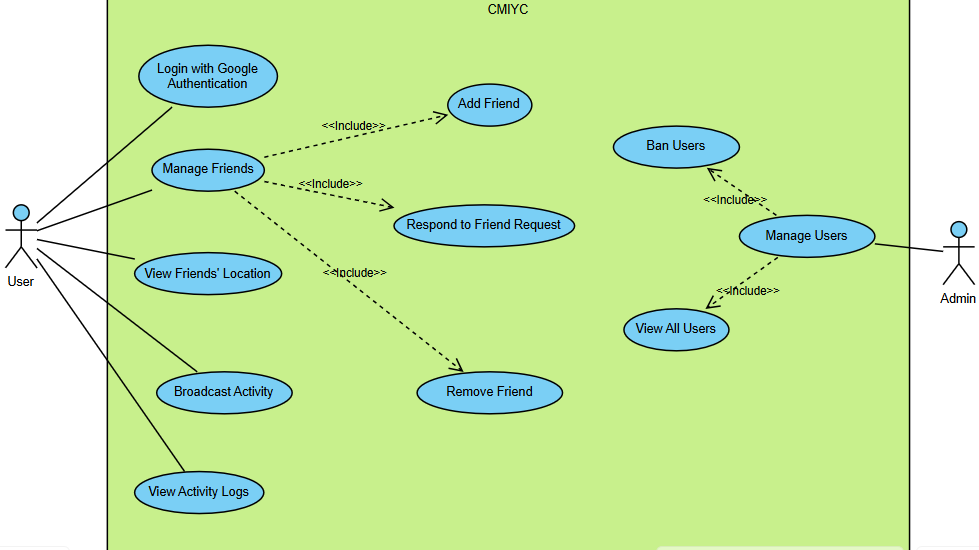
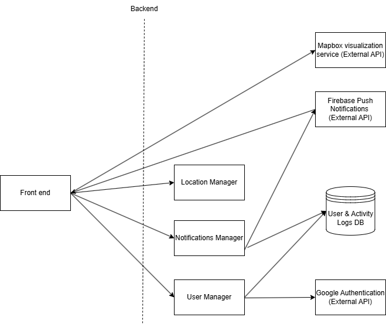
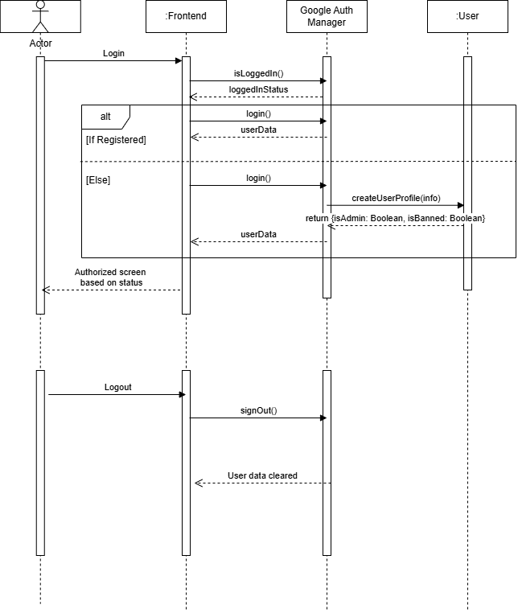
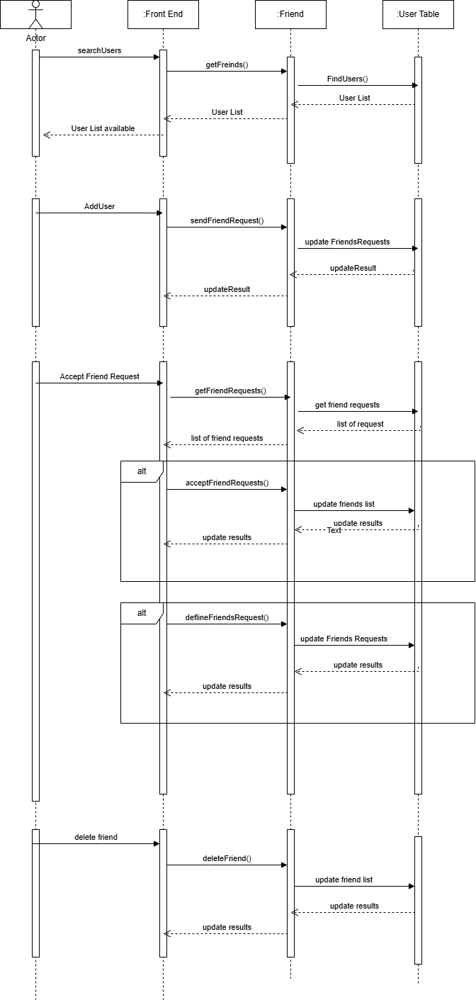
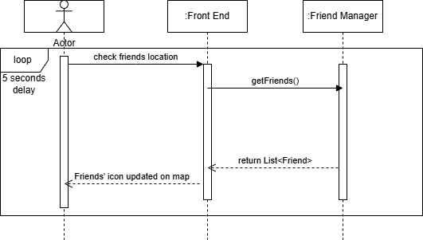
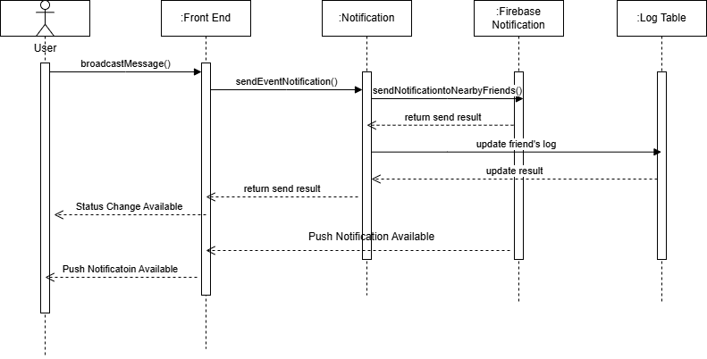
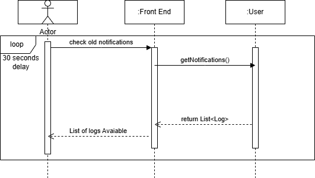
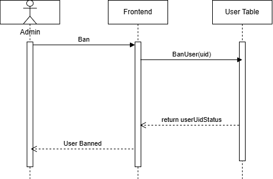

# M4 - Requirements and Design

## 1. Change History

| Date     | Modification Description | Rationale                                                                |
| -------- | ------------------------ | ------------------------------------------------------------------------ |
| 2025.3.1 | Use case diagram         | Implemented feedback from TA                                             |
| 2025.3.1 | 4.1 Main Components      | Updated to accurately reflect our app’s use cases                        |
| 2025.3.1 | Functional Requirements  | Update some functional requirements' wording                             |
| 2025.3.1 | Sequence Diagrams        | Update and improve sequence diagrams based on the modification in design |
| 2025.3.1 | Dependency Diagram       | Correct the Dependency Diagram (Firebase Notification)                   |

---

## 2. Project Description

**Project Name:** CMIYC - Cache Me If You Can!

**Target Audience:** Individuals who enjoy spontaneous meetups with friends but struggle with coordination or discovering who is nearby and available. Target users include young adults, college students, and professionals who value real-time social connections.

**Problem Statement:** Group chats and manual check-ins are inefficient and frustrating, often leading to missed opportunities for meetups.

**Solution:** "Cache Me If You Can!" allows users to share their real-time location with selected friends, enabling seamless coordination for spontaneous hangouts. The app promotes privacy, spontaneity, and immediate engagement.

**Key Features:** Location-sharing with privacy controls, notifications to update friends, log of status messages from friends.

---

## 3. Requirements Specification

### 3.1. Use-Case Diagram



### 3.2. Actors Description

1. **User**: A person who uses the app to share their real-time location and update their status and view their friend’s location.
2. **Admin**: A person who can have access to block users

### 3.3. Functional Requirements

#### **FR1: Login with Google Authentication**

- **Overview**:

  1. Google Login
  2. Log out

- **Detailed Flow for Each Independent Scenarios**:

  - **FR1_1**: Google Login

    - **Description**: When no session is active, new and existing users use Google Authentication service to start a session.
    - **Primary Actors**: User, Admin
    - **Main success scenario(s)**:
      1. New and existing users click on the Google login button on the App’s login page.
      2. User is redirected to a page view where the user enters their Google email and password.
      3. Google Authentication succeeds.
      4. User is redirected out of the login page and into the app’s main page: The map page.
    - **Failure scenario(s)**:
      - 2a. Google authentication service is non-responsive.
        - 2a1. Display error message that Google service is non-responsive and show an OK button.
        - 2a2. When the OK button is clicked, User is redirected back to the login page.
      - 3a. Google authentication fails.
        - 3a1. Users can retry entering their Google email and password.

  - **FR1_2: Logout**
    - **Primary actor(s)**: User, Admin
    - **Main success scenario(s)**:
      1. From a profile page, the user clicks logout.
      2. User logs out successfully.
      3. User is redirected to the login page.
    - **Failure scenario(s)**:
      - 1a. Logout failed; user stays logged in due to network error.
        - 1a1. Display error to logout message and show retry button.

#### **FR2: Manage Friends**

- **Overview**:

  1. Add Friend
  2. Remove Friend
  3. Respond to Friend Requests

- **Detailed Flow for Each Independent Scenarios**:

  - **FR2_1: Add Friend**

    - **Description**: Users can add friends by sending friend requests.
    - **Primary actor(s)**: User
    - **Success scenario(s)**:
      1. User clicks the friends button to access the friend page
      2. User clicks the add friend button
      3. User enters friend’s email address
      4. User submit the friend request
    - **Failure scenario(s)**:
      - 4a. Friend request fails due to a network error.
        - 4a1. Display an error message.
        - 4a2. Retry sending the invitation.
      - 4b. Friend request is not received due to server issues.
        - 4b1. Log the failure and notify the sender.
        - 4b2. Retry sending the invitation.

  - **FR2_2: Remove Friend**

    - **Description**: Users can remove friends from their friend list at any time.
    - **Primary actor(s)**: User
    - **Success scenario(s)**:
      1. User selects a friend to remove.
      2. The friend is removed from the user's friend list.
      3. The user is also removed from the user's friend list.
    - **Failure scenario(s)**:
      - 1a. Removal fails due to a server issue.
        - 1a1. Display an error message.
        - 1a2. Prompt the user to retry removing the friend.

  - **FR2_3: Respond to Friend Requests**
    - **Description**: The user can accept or deny friend requests.
    - **Primary actor(s)**: User, Friend
    - **Success scenario(s)**:
      1. User receives a friend request.
      2. If the user accepts, that friend is added to their friend list and the friend’s list adds the user.
      3. If the user denies, the friend request is cleared.
    - **Failure scenario(s)**:
      - 2a. Friend’s list does not update correctly.
        - 2a1. Ensure server synchronization and retry adding the user to friend’s list.

#### **FR3: View Friends’ Location**

- **Overview**:

  1. Show Friends’ Locations

- **Detailed Flow for Each Independent Scenarios**:

  - **FR3.1 Show Friends’ Locations**
    - **Description**: Users can view their friend’s real-time location.
    - **Primary actor(s)**: User
    - **Main success scenario**:
      1. The user opens the app.
      2. The user can scroll and move the map.
      3. The user sees their friends' locations.
    - **Failure scenario(s)**:
      - 1a. Server fails to update friend locations due to a network error.
        - 1a1. Display an error message.
        - 1a2. Retry location fetching.
      - 2a. Map fails to move in response to the user.
        - 2a1. Display an error message.
        - 2a2. Prompt the user to reload the app

#### **FR4: Broadcast Activity**

- **Overview**:

  1. Set activity message & send a real-time push notification to all nearby friends
  2. Post a new log to all friends' log list

- **Detailed Flow for Each Independent Scenarios**:

  - **FR4.1 Set activity message & send a real-time push notification to all nearby friends**

    - **Description**: From the map page, users can enter their activity message and click on broadcast to let all their friends know.
    - **Primary actor(s)**: User
    - **Main success scenarios**:
      1. The user is on the map page and sets their activity message.
      2. User clicks "Broadcast".
      3. The user’s current activity is sent via push notifications to the user’s friends in a specified radius.
    - **Failure scenarios**:
      - 2a. Broadcasting fails due to network error.
        - 2a1. Display network error message and prompt user to retry broadcasting.
      - 3a. Push notification is not delivered due to network error
        - 3a1. Retry sending push notification up to a maximum of 5 times without notifying user of the error
        - 3a2. If the error still persists after 5 retries, show an error message to the user and prompt them to try broadcasting again.

  - **FR4.2 Post a new log to all friends’ log list**
    - **Description**: When a user broadcasts activity, a new log entry will be added to all friends’ activity logs.
    - **Primary actor(s)**: User
    - **Main success scenarios**:
      1. User clicks on the broadcast with a set activity message.
      2. Every User’s friends’ log list is updated with a new entry. We want it to update every time there is a new entry as we think real-time makes the app more enjoyable.
      3. The new entry contains the broadcaster’s name, activity message, and location.
    - **Failure scenarios**:
      - 1a. Sending broadcast data fails due to network error.
        - 1a1. App retries sending the log message 5 times without notifying the user.
        - 1a2. If max attempts are exceeded, display error messages to the user and prompt them to retry broadcasting.

#### **FR5: View Activity Logs**

- **Overview**:

  1. User views the activity logs.

- **Detailed Flow for Each Independent Scenarios**:

  - **FR5.1 View Notifications**
    - **Description**: The user can view a list of all activity logs received from their friends.
    - **Primary actor(s)**: User
    - **Main success scenario**:
      1. The user switches to the “Activity Log” page
      2. The user can scroll up and down the log to see all received activity logs.
    - **Failure scenario(s)**:
      - 1a. Server fails to update the activity log of broadcasted activities.
        - 1a1. Display an error message.
        - 1a2. Retry activity fetching.

#### **FR6: Manage Users**

- **Overview**:

  1. Ban User
  2. View All Users

- **Detailed Flow for Each Independent Scenarios**:

  - **FR6.1 Ban User**

    - **Description**: Admins can permanently ban users who engage in harmful behavior, ensuring a safe environment. The criteria for banning users is up to the admin. It could be because someone is using the app in a harmful manner as if they are stalking their friends.
    - **Primary actor(s)**: Admin
    - **Main success scenarios**:
      1. Admin selects a user to ban from the system.
      2. The user is banned, preventing them from logging in or accessing the app.
      3. The system notifies the banned user of their status.
    - **Failure scenarios**:
      - 1a. Ban action fails due to a server issue.
        - 1a1. System logs the failure and retries the operation.
        - 1a2. Admin receives an error message if retries fail.

  - **FR6.2 View All Users**
    - **Description**: The admin can view a list of all users currently registered to the app.
    - **Primary actor(s)**: Admin
    - **Main success scenarios**:
      1. Admin views all users
    - **Failure scenarios**:
      - 1a. Admin is unable to see any users due to a server error.
        - 1a1. System logs the failure and prompts the admin to reload the app.

### 3.5. Non-Functional Requirements

1. **NFR1: Real-Time Performance**

   - **Description**: The app follows the Android vitals startup suggestions:
     - Cold startup takes 5 seconds or less.
     - Warm startup takes 2 seconds or less.
     - Hot startup takes 1.5 seconds or less.
   - **Justification**: Quick updates ensure seamless coordination.

2. **NFR2: Scalability**
   - **Description**: The backend must handle at least 1000 concurrent users.
   - **Justification**: Scalability is essential for supporting a growing user base.

---

## 4. Design Specification

### 4.1. Main Components

#### **Location Manager**

- **Purpose**: Stores every User’s location and Handles real-time location updates and sharing.
- **Interfaces**:
  - **updateUserLocation(currentLocation: LocationObject): boolean**
    - REST API (client <-> server)
      - URI: PUT /location/{userID}
      - Body: { "currentLocation": {"latitude": Number, "longitude": Number, "timestamp": Number} }
      - Response: 200/OK (location updated successfully)
    - **Purpose**: Updates the user's current location in the database

#### **Notification Manager**

- **Purpose**: Manages sending notifications to friends.
- **Interfaces**:
  - **setFCMToken(fcmToken: String): boolean**
    - REST API (client <-> server)
      - URI: PUT /fcm/{userID}
      - Body: { "fcmToken": String }
      - Response: 200/OK (token set successfully)
    - **Purpose**: Updates the Firebase Cloud Messaging token for a user to enable push notifications
  - **sendEventNotification(eventName: String): boolean**
    - REST API (client <-> server)
      - URI: POST /send-event/{userID}
      - Body: { "eventName": String }
      - Response: 200/OK (notification sent successfully)
    - **Purpose**: Sends notifications to nearby friends (within 1km) about an event the user is starting
  - **getNotifications(): List\<Log\>**
    - REST API (client <-> server)
      - URI: GET /notifications/{userID}
      - Response: 200/OK with array of notification log objects
    - **Purpose**: Retrieves the user's notification history (log list)

#### **User Manager**

- **Purpose**: Manages user-related operations such as creating the user profile.
- **Interfaces**:
  - **createUserProfile(): boolean**
    - REST API (client <-> server)
      - URI: POST /user
      - Body: { “userID”: String, “displayName”: String, “email”: String, “photoURL”: String, “fcmToken”: String, “currentLocation”: {“latitude”, “longitude”, “timestamp”} }
      - Response: 200/OK (successfully created)
    - **Purpose**: To create a new user profile

#### **Friend Manager**

- **Purpose**: Manages friend-related operations such as sending and accepting friend requests.
- **Interfaces**:
  - **getFriends(): List\<Friend\>**
    - REST API (client <-> server)
      - URI: GET /friends/{userID}
      - Response: 200/OK with array of friend objects
    - **Purpose**: Retrieves all friends for a specific user
  - **sendFriendRequest(friendEmail: String): boolean**
    - REST API (client <-> server)
      - URI: URI: POST /friends/{userID}/sendRequest/{friendEmail}
      - Response: 200/OK (request sent successfully)
    - **Purpose**: Sends a friend request to another user by email
  - **getFriendRequests(): List\<FriendRequest\>**
    - REST API (client <-> server)
      - URI: GET /friends/{userID}/friendRequests
      - Response: 200/OK with array of friend request objects
    - **Purpose**: Retrieves all pending friend requests for a user
  - **acceptFriendRequest(friendID: String): boolean**
    - REST API (client <-> server)
      - URI: POST /friends/{userID}/acceptRequest/{friendID}
      - Response: 200/OK (request accepted successfully)
    - **Purpose**: Accepts a pending friend request
  - **declineFriendRequest(friendID: String): boolean**
    - REST API (client <-> server)
      - URI: POST /friends/{userID}/declineRequest/{friendID}
      - Response: 200/OK (request declined successfully)
    - **Purpose**: Declines a pending friend request
  - **deleteFriend(friendID: String): boolean**
    - REST API (client <-> server)
      - URI: PUT /friends/{userID}/deleteFriend/{friendID}
      - Response: 200/OK (friend removed successfully)
    - **Purpose**: Removes a friend from the user's friend list

### 4.2. Databases

1. **MongoDB**
   - **User Table**
     - **Purpose**: Stores `userID`, `Name`, `List of friends`, `userPhoto`, and `Last known location`.
     - **Reason**: We need a persistent store of User information and their friends. This data should not be lost when the server is restarted. We chose MongoDB for our project due to its flexibility, scalability, and ability to handle data efficiently. Its schema-less structure allows us to store dynamic user data without rigid migrations, and its JSON-like document structure integrates seamlessly with our Node.js backend, enabling fast development.
   - **Activity Logs Table**
     - **Purpose**: We need a persistent store for every user, the event logs they receive
     - **Reason**: Activity logs are ground truth and should persist between server restarts.

---

### 4.3. External Modules

1. **MapBox Mobile Maps SDKs**

   - **Purpose**: Provides map visualizations for the map page of the app.
   - **Reason**: Users need to see the roads/buildings of their friends’ location pins.

2. **Google Sign In**

   - **Purpose**: Allows the user to log in/sign up.
   - **Reason**: It saves the user time by offering an easier and faster solution to join the app.

3. **Firebase Push Notifications**
   - **Purpose**: Allows the user to receive push notifications from the server.
   - **Reason**: It is used to notify the user of new activities from their friends, or friend requests, etc.

---

### 4.4. Frameworks

1. **MongoDB**

   - **Purpose**: To store user information such as name, profile photo, friends list, etc.
   - **Reason**: The app needs access to the above information to display the user account. It also needs the friends list to display certain friends.

2. **Amazon Web Services EC2**
   - **Purpose**: Hosts the MongoDB and Location Processing services. Additionally, provides flexibility in choosing necessary compute resources.
   - **Reason**: Instead of doing the work and algorithm on the app, the backend services process data in the cloud.

---

### 4.5. Dependencies Diagram



---

### 4.6. Functional Requirements Sequence Diagram

#### **FR1: Authentication using Google**



#### **FR2: Manage Friends**



#### **FR3: View Friends' Location**



#### **FR4: Broadcast Activity**



#### **FR5: Manage User**



#### **FR5: Manage User Profile**



---

### 4.7. Non-Functional Requirements Design

1. **Real-Time Performance**

   - **Validation**: Conduct tests on the app to make sure that it provides a seamless and easy experience for the user. Worst case it should take 2 seconds to update the location.

2. **Scalability**

   - **Validation**: Use a distributed server architecture.

3. **Compatibility**
   - **Validation**: The app should be compatible with Android devices running Android 12 (API 31) and above.

---

### 4.8. Main Project Complexity Design

#### **Component: Location Manager**

- **Description**: Store location data of each user and detect nearby friends efficiently using a quadtree proximity search algorithm. We plan on doing this every single time a broadcast event is called as storing the tree and updating it whenever a location is updated doesn’t make sense, as there will need to be a tree for each set of friends then

- **Why complex?**:

  - The unoptimized version of the location manager involves storing the key-value pair `{UserID : {latitude, longitude}}` for each `UserID`. On location updates, we would update the corresponding value. However, computing if another friend is nearby requires searching all friends’ locations. This linear time computation does not scale well when we have more users with more friends.
  - A quadtree is a tree-like data structure. Each node represents a rectangle on the Earth's surface. Each node has 4 children, each representing a quadrant of the parent. Since we know the broadcaster’s location, we only need to search for friends in one of the nodes above. This greatly improves efficiency as we reduce to a logarithmic time complexity.

  - 

- **Design**:

  - **Use case**: Find all nearby friends who we should send push notifications to when the user broadcasts activity.
  - **Input**:
    - `userId` of the user broadcasting activity.
    - `Latitude`, `Longitude` of the user broadcasting activity.
  - **Output**:
    - `userId` of User’s friends who are within a 500m radius.
  - **Main computational logic**:
    1. **Define the Quadtree**:
       - The quadtree will store the latitude and longitude of all users.
       - Each node in the quadtree represents a region of the Earth's surface and can split into four sub-quadrants.
    2. **Insert Users into the Quadtree**:
       - For each user, insert their latitude and longitude into the quadtree.
    3. **Query for Nearby Friends**:
       - Given the broadcasting user's latitude and longitude, traverse the quadtree to find all points within a 500-meter radius.

- **Pseudo-code**:

```plaintext
1. Define Quadtree Node:
   - Properties: min_lat, max_lat, min_lon, max_lon, points[], children[]

2. Insert Point into Quadtree:
   - If point not in bounds, return False
   - If node has capacity, add point
   - Else:
     - Split node into 4 quadrants (NW, NE, SW, SE)
     - Reinsert points into children

3. Query Nearby Friends:
   - If node does not intersect query circle, return
   - For each point in node:
     - If distance(point, query) ≤ radius, add to results
   - Recursively query children

4. Distance Calculation (Haversine):
   - Convert lat/lon to radians
   - Compute distance using Haversine formula
   - Return distance in meters

5. Main Logic:
   - Initialize Quadtree with Earth bounds (-90 to 90 lat, -180 to 180 lon)
   - Insert all users into Quadtree
   - Query Quadtree for friends within 500m of broadcasting user
   - Return results
```

---

## 5. Contributions

- **Peter Scholtens**:

  - Design Specification 4.1-4.4
  - Sequence diagram R1, R6
  - Functional Requirements FR2
  - Reviewed All Sections

- **Antonio Qiao**:

  - Functional requirements
  - Non-functional requirements
  - Sequence diagram FR4 and FR5
  - Markdown creation
  - Reflection

- **Deepan Chakravarthy**:

  - Functional Requirements: FR1, FR4
  - Dependency Diagram
  - Main project Complexity Design
  - Review sections

- **James Lee**:
  - Use case diagram
  - Main actors and descriptions
  - Functional Requirements: FR3, FR6
  - Sequence diagram FR2, FR3
  - Reviewed all sections
